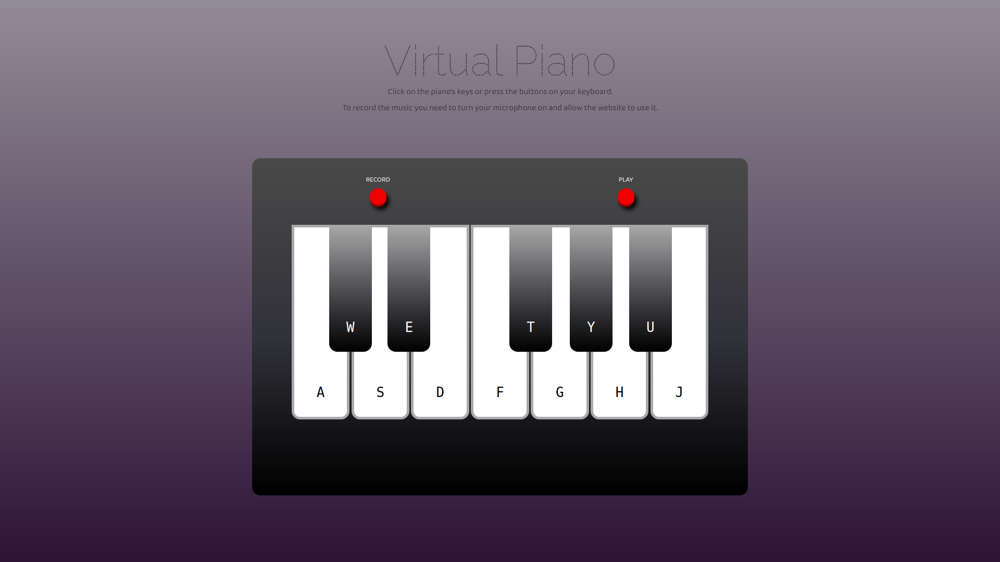

# Virtual-Piano

A simple virtual piano which can be used to play a music on virtual piano's keyboard. Record button which records the music played on the piano and a play button which enable listening to the recorder music were added as an additional feature.

To record the music you need to turn the microphone on and allow the website to use it.

> The project was created based on a JetBrains course.

## Used: 
- HTML
- CSS
- TypeScript

## Preview:
Check the preview here: *https://cenora6.github.io/Virtual-Piano/*
