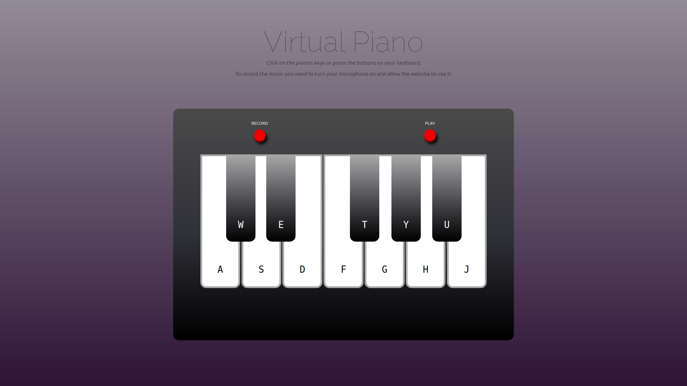

# Virtual-Piano

## Description

A simple virtual piano which can be used to play a music on virtual piano's keyboard. Record button which records the music played on the piano and a play button which enable listening to the recorder music were added as an additional feature.

To record the music you need to turn the microphone on and allow the website to use it.

> The project was created based on a JetBrains course.

## Live Demo
[Virtual Piano - Live Preview](https://cenora6.github.io/Virtual-Piano/)

## Technologies and additional dependencies:

| Tool | Description |
| :-------------:|--------------|
| HTML5 | A markup language used for structuring, and presenting content on the World Wide Web. |
| CSS | A simple mechanism for adding style to Web documents. |
| [Typescript](https://www.npmjs.com/package/typescript/) | An open-source language which builds on JavaScript. |
